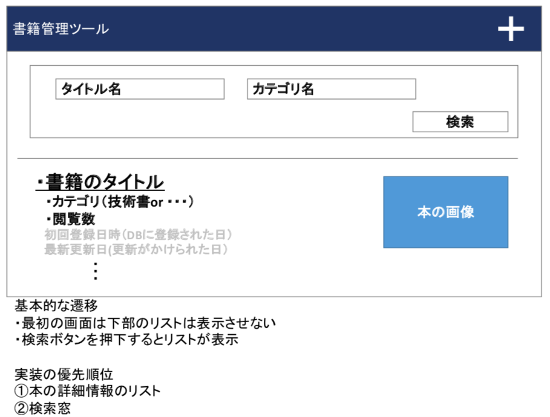

# trial_book-management
====

Book management application by Django.
For my practice, I have developed simple book_management tool by django and MySQL.
You can manage your favorite books with category, book image and number of access easily.

## What you can do

1. Register and list your favotrite books.
2. Edit your fovorite books information.
3. Know the most popular books by numnber of access.


**image is under construction**

##

# Dependency

## Script

* Python == 3.6.6 (Anaconda Custome)

## Required package

* dj-database-url==0.5.0
* Django==2.1
* gunicorn==19.9.0
* psycopg2-binary==2.7.5
* pytz==2018.5
* whitenoise==4.0

## DB

*MySQL 8.0.12

# Setup

**This application is developed by Python Anaconda custome, and development environment is based on Windows.**

0. Install Anaconda.(Reference ⇒ [Anaconda Download](https://www.anaconda.com/download/)
1. Set up Django environment.(Reference ⇒　[Django Girls Tutorial](https://tutorial.djangogirls.org/ja/)
2. Set up MySQL environment. (Reference ⇒ [MySQL Download](https://www.mysql.com/jp/downloads/)
3. Set up Django and Mysql connection. Update following code in "setting.py".
```
DATABASES = {
    'default': {
        'ENGINE': 'django.db.backends.mysql',
        'NAME': 'your db',  
        'USER': 'root',  
        'PASSWORD': 'hogehogehoghe',  
        'HOST': '', 
        'PORT': '', 
    }
}
```
4. Download all directory from my repogitory.
5. Add installed apps in "setting.py".
```
INSTALLED_APPS = [
    'django.contrib.admin',
    'django.contrib.auth',
    'django.contrib.contenttypes',
    'django.contrib.sessions',
    'django.contrib.messages',
    'django.contrib.staticfiles',
    'blog',
]
```
6. Run following code.
```
python manage.py runserver
```
7. Access following address.
```
http://127.0.0.1:8000/
```

# Usage

**under construction**

# Licence
This software is released under the MIT License, see LICENSE.

# Authors

* human92
* ystk

# References
* [Django Girls Tutorial](https://tutorial.djangogirls.org/ja/)
* [Django official Document](https://www.djangoproject.com/)
* [@okoppe](https://qiita.com/okoppe8/items/66a8747cf179a538355b)
